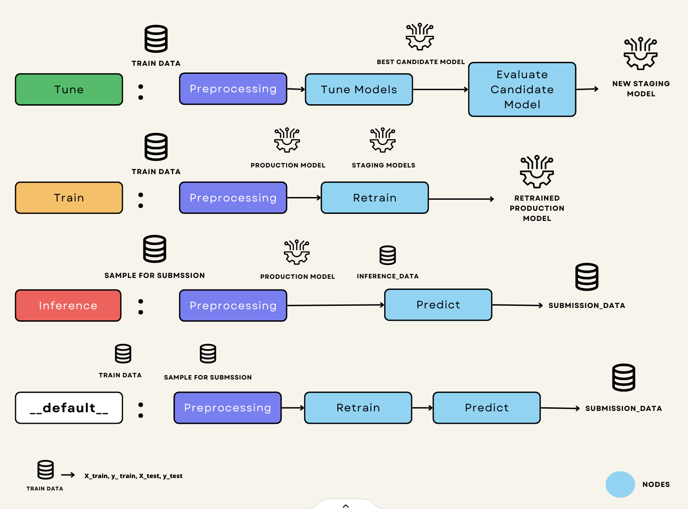

# Kaggle's Spaceship-Titanic Project with Kedro and MLflow.

Welcome to the Spaceship-Titanic project repository, where I explore and apply MLOps techniques using the Kedro and MLflow tools. In this project, I aim to enhance my experiences in developing, training, and deploying Machine Learning models, following best practices.

## About the Project

In the year 2912, your mission is to solve a cosmic mystery. The Spaceship Titanic, an interstellar passenger liner, encountered a spacetime anomaly, transporting passengers to an alternate dimension. Your task is to predict which passengers were affected by the anomaly based on recovered computer system records.

In this project we'll use Kedro to structure our data science workflow and MLflow to track and manage our models. This allows us to achieve a more organized and reproducible development process.

While the primary focus of this project is the implementation of MLOps practices using Kedro and MLflow, it's gratifying to note that I've achieved a respectable position on the Kaggle leaderboard. Currently, I are ranked in the top 14% in the Titanic Kaggle competition with not as much effort (yet) put into exploratory analysis and feature engineering. (Feel free to use this project as a foundation or template to build upon and achieve better positions!)

This achievement demonstrates that it is possible to balance the implementation of efficient development, training, and model monitoring processes with competitive performance in Machine Learning competitions.

In this project, I have applied MLOps practices, including:

- Utilizing Kedro to structure the data science workflow.
- Tracking metrics, experiments, and model versions with MLflow.
- Automated model "deployment" to ensure environment consistency.
- Continuous integration and continuous delivery (CI/CD) to automate model training and "deployment".

I'm pleased to share my journey of learning and applying MLOps with you in this project.

## Directories

Our directories follow the Kedro structure:

- **src/**: Contains project modules and their pipelines.
- **conf/base/**: Shared project configurations.
- **conf/local/**: Environment-specific configurations (not pushed to git).
- **notebooks/**: Interactive notebooks for data analysis and visualization.
- **data/**: Stores raw, intermediate, and processed data.
- **mlruns/**: Created after the first run. Stores all information (logs, models, parameters, metrics) related to MLflow.

More info: [Kedro Architecture Overview](https://docs.kedro.org/en/0.18.3/faq/architecture_overview.html#:~:text=Kedro%20project&text=The%20conf%2F%20directory%2C%20which%20contains,source%20code%20for%20your%20pipelines.)

## Workflow



## Pipelines

### Pipeline Registry

To view the pipeline registry the following command:

```bash
kedro registry list

- __default__
- data_processing
- data_science
- model_inference
- model_training
```

### Pipelines Descriptions

- `data_processing`: Where the data is processed and features are generated. This pipeline is reused during inference.

- `data_science`: Among a series of candidate models, each model is tuned with training data (X_train, y_train), and the model that performs best on test data (X_test, y_test) is selected. Afterward, it is automatically verified if this model is superior to the current production model; if yes, this model is registered in staging. If there is no production model (for example, the first run), the candidate model is automatically saved if its performance is better than a given threshold.

- `model_training`: The production model is loaded and retrained with new data. The production model is replaced by the retrained model only when the retrained model's performance on the new test data is at least 3% better than the performance of the current untrained model. Such verification does not make sense for this project since the data is static.

- `model_inference`: In the submission competition's feature data, the same preprocessing and data treatments as the training data are applied. Upon these data, the production model is used to generate the submission csv file with IDs and predictions.

## Getting Started

1. Clone this repository: `git clone https://github.com/Wilsven/spaceship-titanic.git`
2. Install the necessary dependencies: `make install` for runtime and `make install-dev` for development.
3. Explore the Kedro workflow in [src/](src/).
4. Monitor and manage your experiments in MLflow.
5. Run the default pipeline with the command: `kedro run`
6. To run individual pipelines, execute the command: `kedro run -p {pipeline_name}`. For example, `kedro run -p pp` will run the preprocessing pipeline. Usually, we will want to run the tuning pipeline (which may take some time) to deploy a good model in production and then run the inference pipeline.
7. For experiment/run visualizations and models saved with MLflow, run the command: `kedro mlflow ui`. Furthermore, through this interface, we can manually manage which registered models will be used in production.

## Contribution

Feel free to create pull requests or open issues to discuss improvements and new ideas.

## License

This project is licensed under the [MIT License](LICENSE).
